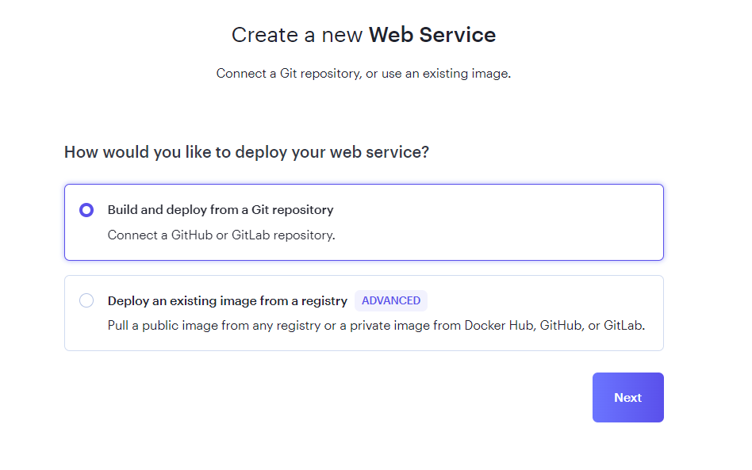
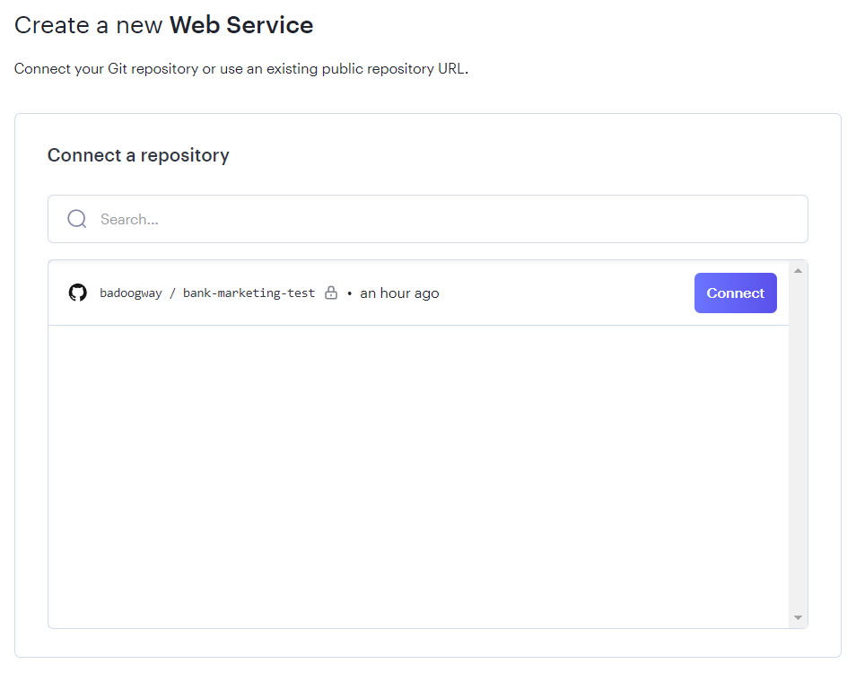
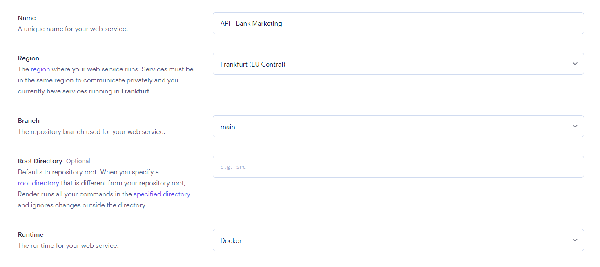
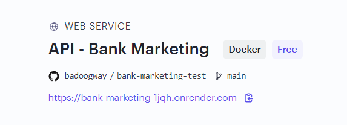

# 🏦 Bank Marketing
The data is related with direct marketing campaigns (phone calls) of a Portuguese banking institution. The classification goal is to predict if the client will subscribe a term deposit (variable y).

## The Problem Domain
The problem domain for the Bank Marketing involves analyzing the direct marketing campaigns of a Portuguese bank that primarily utilized phone calls to reach potential clients. These campaigns aimed to persuade clients to subscribe to a bank term deposit, and the outcome was whether the client agreed ('yes') or declined ('no').

To illustrate, consider a scenario where a telemarketer working for the bank accesses a customer relationship management (CRM) system to identify potential clients. They make a series of phone calls to these clients, providing information about the bank's term deposit and attempting to convince them to invest. Oftentimes, it may take multiple calls or interactions with the same client to determine if they will subscribe to the product. For example, a client initially might say 'no' to the offer, but after a follow-up call, they might decide to subscribe, resulting in a 'yes' outcome.

The core challenge within this domain lies in understanding the factors that influence a client's decision to subscribe and optimizing the bank's marketing strategies accordingly. By examining the data from these campaigns, the bank can gain insights into client preferences, the effectiveness of multiple contacts, and the best approaches for future marketing endeavors, ultimately aiming to increase 'yes' responses and enhance their campaign success.

## Getting Started
Start by cloning the project's Git repository. Run this command to create a local copy:
```bash
$ git clone https://github.com/bank-marketing.git
```

If you haven't installed Pipenv yet, you can do so with this command:
```bash
$ pip install pipenv
```

Then, navigate to the project directory and install the project's dependencies using Pipenv:
```bash
$ cd bank-marketing
$ pipenv install -d
```

If you wish to retrain the model or fine-tune it for your specific needs, you can use the following command (this step is *optional*):
```bash
$ pipenv run python src/train.py --csv_path="data/bank-full.csv" --csv_separator=";" --model_output_path="models/1.0-xgboost.bin"
```

Now let's explore deployment options.

### Local Deployment via Docker
Build the Docker image using the provided Dockerfile:
```bash
$ docker build -t bank-marketing .
```

Run the Docker image with the following command:
```bash
$ docker run -it --rm -p 9696:9696 bank-marketing
```

You've now deployed the web service locally, and you can test the prediction API by sending requests to `http://localhost:9696/predict`

### Cloud Deployment via Render
Set up your account on [Render](https://render.com/) - a unified cloud platform for building and running applications and websites.

In the [Render Dashboard](https://dashboard.render.com/), click "New +" and select "Web Service" as the service type. Follow the provided form, choosing to build and deploy from a Git repository.

<p align="center">
  
</p>

Provide your GitHub credentials and select the repository containing your Dockerfile.

<p align="center">
  
</p>

Connect to your repository and configure project settings, ensuring that you choose the Docker runtime for containerized deployment.

<p align="center">
  
</p>

Create your web service by clicking "Create Web Service", and Render will automatically build and run your Docker application, providing you with a host URL. You can send requests and receive responses from this URL.

<p align="center">
  
</p>

Great job! Your cloud-based web service is now up and running. To test the prediction API, simply send your requests to `http://{HOST_URL}/predict`. In the context of this project, the host URL is `http://bank-marketing-1jqh.onrender.com/predict`

#### Sample Request
Here's a sample request that you can use for testing your deployed API. You can gain deeper insights into the API's functionality by exploring the Jupyter notebook in `notebooks/testing-api.ipynb`.
```bash
{
    'client_id': 12314,
    'age': 72,
    'job': 'retired',
    'marital': 'married',
    'education': 'secondary',
    'default': 'no',
    'balance': 5715,
    'housing': 'no',
    'loan': 'no',
    'contact': 'cellular',
    'day': 17,
    'month': 'nov',
    'duration': 1127,
    'campaign': 5,
    'pdays': 184,
    'previous': 3,
    'poutcome': 'success'
}
```

## Project Structure
```bash
├── .gitignore              <- Configuration file that specifies which files to exclude from Git version control
├── Dockerfile              <- Configuration file for building a Docker image of the project
├── Pipfile                 <- Specifies project dependencies using Pipenv
├── Pipfile.lock            <- Automatically generated file that locks the versions of dependencies
├── README.md               <- Comprehensive documentation file providing project information and usage instructions
├── data                    <- Directory for storing project-related data
│   └── bank-full.csv       <- A dataset file containing information for exploration and model training
├── models                  <- Directory for storing trained models
│   └── 1.0-xgboost.bin     <- A binary file representing a trained model
├── notebooks               <- Directory for Jupyter notebooks used for data exploration and API testing
│   ├── brief-exploration.ipynb   <- Jupyter notebook for an exploration of the data
│   └── testing-api.ipynb         <- Jupyter notebook for testing the API functionality
├── references              <- Directory of images used for manual and reference purposes
│   ├── connect_to_github.png
│   ├── create_web_service.png
│   ├── deployed_app.png
│   └── set_up_project.png
└── src                     <- Source code directory
    ├── predict.py             <- Python script for making predictions using a trained model
    ├── preprocessing.py       <- Python script for data preprocessing tasks
    └── train.py               <- Python script that serves as a full pipeline of preprocessing data and training a model

```